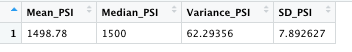
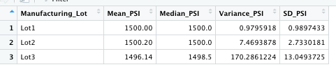
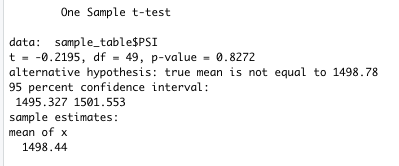
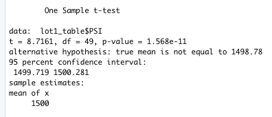
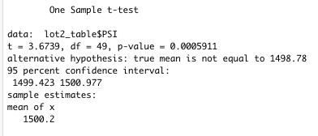
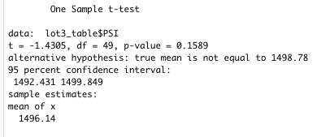

# MechaCar_Statistical_Analysis
Statistical Analysis for AutosRUs on Mecha Car with R
## Linear Regression to Predict MPG

* We run a multiple linear regression to predict MPG.
* The dependent variable is MPG.
* The independent variables are vehicle length, vehicle weight, spoiler angle, ground clearance and awd.
* The results of the multiple linear regression are displayed below.

* The equation for the multiple linear regression is as follows:

mpg = -104.0 + 6.27(vehicle_length) + 0.0012(vehicle_weight) + 0.0069(spoiler_angle) + 3.55(ground_clearance) - 3.41(AWD)

* The results of the linear regression show that the only variables that are statistically significant are the intercept, vehicle_length and ground_clearance. A change in vehicle length and ground clearance has a positive and statistically significant effect on mpg. The intercept is also positive and statistically significant. This means that it explains some of the variability in the dependent variable (mpg) when all the independent variables are equal to zero. This could imply that there are other variables that can help explain the variability in mpg or/and vehicle length and ground clearance variables may need sclaing or tranforming to improve the predictive power of the model.
* The slope of the linear model is not zero. The R-squared of the model is 0.71 and the p-value of our model is much smaller than 0.0001. This means that our model is statistically significant and that it explains 70% of the variability in mpg. Hence, there is sufficient evidence to reject the null hypothesis and the slope of our linear model is not zero.
* Even though the predictive power of our linear model (r-squared=0.71) is not very low and it is statistically significant, we only have vehicle_length and ground clearance as statistically significant variables. These are the only variables that explain some of the variation in mpg. Thus, even though this model seems to be good at predicting the existing model, the results of this model cannot be confidently generalized to predict future models effectively. The relativey high square and lack of sufficient significant variables explaining the dependent variables might be a sign of overfitting.

## Summary Statistics on Suspension Coils

* The mean PSI for total lots is 1498.78, the median is 1500 and the variance is 62.30. When we look at the individual lots, we can see that the mean and the median are very similar to the mean of the total lots. However, the variance is quite different among the lots and also from the total data. Lot3 has the largest variance while Lot1 has the smallest variance.
* The variance of the suspension coils for all manufacturing lots (total) is 62.29 which is below the maximum variance allowed(100).

* When we look at the individual lots however we see that the variance for Lot1 and Lot2 are below the maximum allowed level and are 0.98 and 7.47 respectively. The variance of Lot3 is 170.29, which is above the maximum limit of 100. Thus, while the current data meets the design specification for all manufacturing lots in total, and for Lot1 and Lot2, it does not meet the requirement for Lot3.

## T-Tests on Suspension Coils

* We first generate random sample (n=50) from our population. We test this sample (which includes lot1, lot2,lot3) against the population. 
* The table below shows the results of a one-sample t-test to determine if the mean of all manufacturing lots is statistically different from the population mean of 1500 PSI.
 
 
 
 * From the results of the one-sample t-test we can see that the p-value is 0.8272 > 0.05, which means that there is no statistical difference between our observed sample mean and the population mean. This is a desired result as we would want our sample to be a good representative of our population.
 * Next, we perform one-sample t-test for the individual lots and the population data.
 * The table below shows the one-sample t-test performed between the data for Lot1 and the population. The results show tht the p-value for Lot1 is 1.568e-11 which is much smaller than 0.05. Hence, we rejectthe null hypothesis and state that the mean of our observed sample of Lot1 is statistically different than the population mean.

 

 * The table below shows the one-sample t-test performed between the data for Lot2 and the population. The results show that the p-value for Lot1 is 0.0005911 which is much smaller than 0.05. Hence, we reject the null hypothesis and state that the mean of our observed sample of Lot2 is statistically different than the population mean.

 

* The table below shows the one-sample t-test performed between the data for Lot3 and the population. The results show that the p-value for Lot1 is 0.1589 which is greater than 0.05. Hence, we fail to reject the null hypothesis and state that the mean of our observed sample of Lot3 is statistically not different from the population mean.

 

 ## Study Design: MechaCar vs Competition

 * One of the metrics we can use to compare the performance of MechaCar to its competitors is the fuel efficiency. We can investigate if the average highway fuel efficiency of MechaCar vehicles is statistically different from the average highway fuel efficiency of the comptetitors. Our null and alternative hypotheses will be as follows:
 
 H0: There is no statistical difference between the mean fuel efficiency of MechaCar and the competitors. 
 
 H1: There is statistical difference between the mean fuel efficiency of MechaCar and the competitors. 
 
 * The test we can perform to test our hypothesis is two-sample t-test. Two-sample t-test is suitable for this analysis because we have two separate samples (one sample of MechaCar and the other one consisting of competitors) and our input data (e.g. highway fuel efficiency) is numerical and continuous. In order to do this, the competitors should be determined and data on the fuel efficiency of the competitor vehicles and MechaCar vehicles should be collected. Of course, this test will only allow us to find out if the highway fuel efficiency of MechaCar different from its competitors in total. It will not provide a comparative analysis between indivudal competitors and MechaCar. The test will basically be comparing the means of the competitor market and MechaCar. This will still allow AutosRus team to draw some insights as to how they are doing compared to the market. In order to compare individual competitors to MechaCar, a large enough data for each competitor should be collected. Then, two-sample t-test can be performed separately between each competitor and MechaCar.
 
 * Another metric we can use to compare the performance of MechaCar to its competitors is the maintenance cost. We can investigate if the average maintenance cost of a car of similar class is statistically different across differemt car manufacturers--one of the manufacturers being MechaCar. The null and alternative hypothesis are:

 H0: The means of maintenance costs of all car groups are  equal.

 H1: At least one the means of maintenance cost is different from all other groups.

 * We can use One-way ANOVA to test our hypothesis. One-way ANOVA allows us to test the means of single dependent variable across a single independent variable with multiple groups. The dependent variable in this model will the maintenance cost and the independent variable will be different car manufacturers. We will need data on the maintenance cost for different car manufacturers and also for MechaCar. In order to find out which cars have statistically different costs than MechaCar we need to perform post hoc test.
 